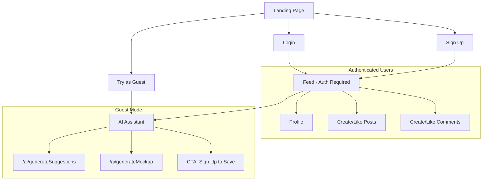

# Add Guest Mode Feature

## Current State

- The `/assistant` route currently requires authentication via `ensureAuth` middleware
- The AI API endpoints (`/ai/generateSuggestions`, `/ai/generateMockup`) have **no auth middleware** - they're already accessible
- Social features (feed, profile, posts, comments) are protected by `ensureAuth`
- The header navigation shows all links regardless of auth status

## Implementation Strategy

Allow the assistant page to work for both authenticated users and guests, with conditional UI that shows/hides social features based on auth status.

---

## Files to Modify

### 1. Routes - Allow Guest Access to Assistant

**[routes/main.js](routes/main.js)** - Remove `ensureAuth` from the assistant route:

```javascript
// Before
router.get("/assistant", ensureAuth, homeController.getAssistant);

// After
router.get("/assistant", homeController.getAssistant);
```

### 2. Controller - Pass Auth Status to View

**[controllers/home.js](controllers/home.js)** - Pass user info to the assistant view:

```javascript
getAssistant: (req, res) => {
  res.render("assistant.ejs", { 
    user: req.user || null,
    isGuest: !req.isAuthenticated()
  });
},
```

### 3. Create Guest Header Partial

**[views/partials/header-guest.ejs](views/partials/header-guest.ejs)** (new file) - Minimal header for guests:

- Show logo
- Show "AI Design Assistant" link (current page)
- Show "Login" and "Sign Up" buttons
- Hide: Feed, Profile, New Project, Logout

### 4. Update Assistant View

**[views/assistant.ejs](views/assistant.ejs)** - Conditionally include the appropriate header and add guest prompts:

```ejs
<% if (isGuest) { %>
  <%- include('partials/header-guest') -%>
<% } else { %>
  <%- include('partials/header') -%>
<% } %>

<!-- Add call-to-action for guests after mockup generation -->
<% if (isGuest) { %>
  <div class="alert alert-info mt-4">
    <a href="/signup" class="btn btn-primary">Sign up</a> to save your designs and share with the community!
  </div>
<% } %>
```

### 5. Update Landing Page

**[views/index.ejs](views/index.ejs)** - Add a "Try as Guest" button alongside login/signup:

```ejs
<a href="/assistant" class="btn btn-secondary">Try AI Designer (No Account Needed)</a>
```

---

## Architecture Flow



---

## Optional Enhancements

- **Rate limiting**: Add middleware to limit guest API calls (e.g., 5 mockups per session/IP)
- **Session tracking**: Store guest mockups in session for later retrieval after signup
- **Analytics**: Track guest-to-signup conversion
